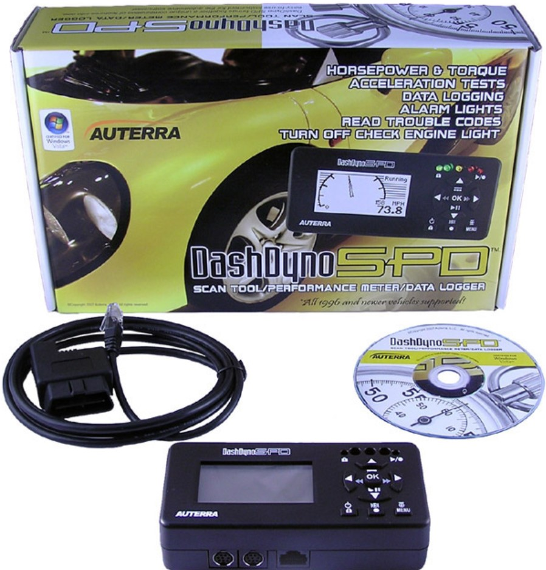
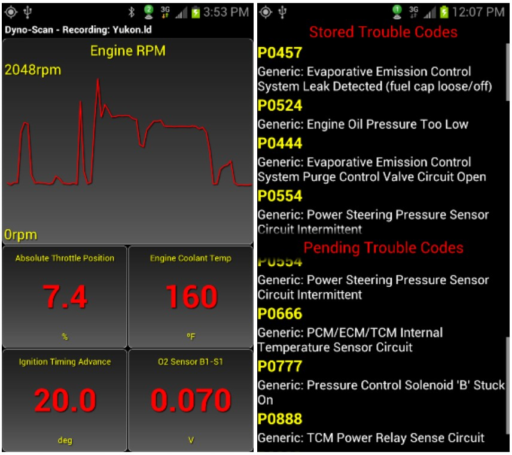

# OBD-II Scan Tool Adapter 

C language source code and schematic for an automotive OBD-II scan tool adapter. 

# Table of Contents

- [OBD-II Scan Tool Adapter](#obd-ii-scan-tool-adapter)
- [Table of Contents](#table-of-contents)
- [Overview](#overview)
- [Auterra Scan Tools](#auterra-scan-tools)
- [OBD-II Adapter Host Protocol](#obd-ii-adapter-host-protocol)
  - [Enhanced OBD-II](#enhanced-obd-ii)
- [OBD-II Adapter Software Source Code](#obd-ii-adapter-software-source-code)
  - [SAE J1850 VPW/PWN](#sae-j1850-vpwpwn)
  - [ISO 9141 and 14320](#iso-9141-and-14320)
  - [ISO 15765](#iso-15765)
- [OBD-II Adapter Hardware Schematic](#obd-ii-adapter-hardware-schematic)
- [Why Open Source?](#why-open-source)
- [Auterra Scan Tool Products](#auterra-scan-tool-products)
  - [Dyno-Scan for Windows](#dyno-scan-for-windows)
  - [DashDyno SPD](#dashdyno-spd)
  - [Dyno-Scan for Android](#dyno-scan-for-android)

# Overview

An OBD-II (On-Board Diagnostics II) scan tool adapter serves as a bridge device between a host (e.g. PC, phone, embedded device) and the vehicle. The OBD-II adapter translates serial messages to and from OBD-II vehicle messages. The adapter supports all known OBD-II automotive protocols starting from 1996 model year. 

* SAE J1850 (VPW, PWM)
* ISO 9141-2 (ISO)
* ISO 14320-4 (KWP 2000)
* ISO 15765-4 (CAN bus)

A vehicle 16-pin OBD-II connector is typically located on the driver's size under the dashboard.

The software source code is being open-sourced for public use under the MIT License.

# Auterra Scan Tools

The Auterra series of scan tools was sold for about 15 years starting in 2000. Different versions of the tool were sold. See the [docs](docs/) folder for user manuals.

* [DashDyno SPD](/docs/DashDynoManual.pdf) - an all-in-one handheld scan tool
* [Dyno-Scan for Windows](/docs/Dyno-ScanWindowsManual.pdf) - a Windows scan tool (serial, USB, Bluetooth)
* [Dyno-Scan for Android](/docs/Dyno-ScanAndroidManual.pdf) - a Android scan tool for phone/tablet (Bluetooth)
* [Dyno-Scan for Palm OS](/docs/Dyno-ScanPalmManual.pdf) - a Palm Pilot scan tool (serial)

A road dynamometer feature was added to measure horsepower and torque during vehicle acceleration extending the usefulness beyond diagnostics.

See [Auterra Scan Tools](http://auterraweb.com/index.html) company website for more product information. 

# OBD-II Adapter Host Protocol

The OBD-II host protocol is documented within the [OBD II Adapter Protocol](/docs/OBD%20II%20Adapter%20Protocol.pdf) document.

## Enhanced OBD-II

"Enhanced OBD-II" refers to a more advanced version of the standard OBD-II system, which provides additional diagnostic information specific to a vehicle's manufacturer. Whereas the generic OBD-II standards are readily available, the manufacturer specific protocol specifications are obtained with a subscription from [ETI](https://etools.org/). 

The OBD-II adapter source code supports generic and enhanced protocols. Auterra products supported enhanced OBD-II from many vehicle manufacturers such as GM, Ford, Toyota, Nissan, and Mazda. 

# OBD-II Adapter Software Source Code

The OBD-II adapter software is written in C and compiled using [CCS](https://www.ccsinfo.com/compilers.php) PCH C Compiler, Version 3.167. The code executes on the Microchip PIC18F248 microcontroller. The source code serves as a translator of generic (universal) and enhanced (manufacturer specific) OBD-II messages to/from a host device.

The adapter source code is located within the [src](/src/) directory. **Main.HEX** is the last adapter release. 

## SAE J1850 VPW/PWN

VPW and PWM are legacy protocols used by Ford (PWM) and GM (VPW). These interfaces were painstakingly bit-banged using assembly language and a logic analyzer. Excellent comments document the source code. Software simulation tools assisted with development.

## ISO 9141 and 14320

The ISO and KWP protocols are serial interfaces. A software-based UART available as part of the CCS compiler turns any unused port into a serial interface.

## ISO 15765

CAN bus is the latest OBD-II interface with all known speeds and modes supported by the source code. The Microchip processor has an on-board CAN bus interface.  

# OBD-II Adapter Hardware Schematic

The OBD-II adapter schematic is shown below. Actually its from the DashDyno, so the MODULAR 10 connector is a DB9 on the adapter variants. Both cable diagrams shown below. 

# Why Open Source? 

Auterra products are no longer commercially available. However, the released source code and documentation may serve as valuable resources for future automotive-related projects.

# Auterra Scan Tool Products

Auterra products were designed for Palm OS, Windows, Android and DashDyno platforms. All products utilized the Microchip OBD-II adapter interface processor. Software languages utilized across the various platforms was C, C++, C#, Java and assembly. 

## Dyno-Scan for Windows

## DashDyno SPD

## Dyno-Scan for Android

